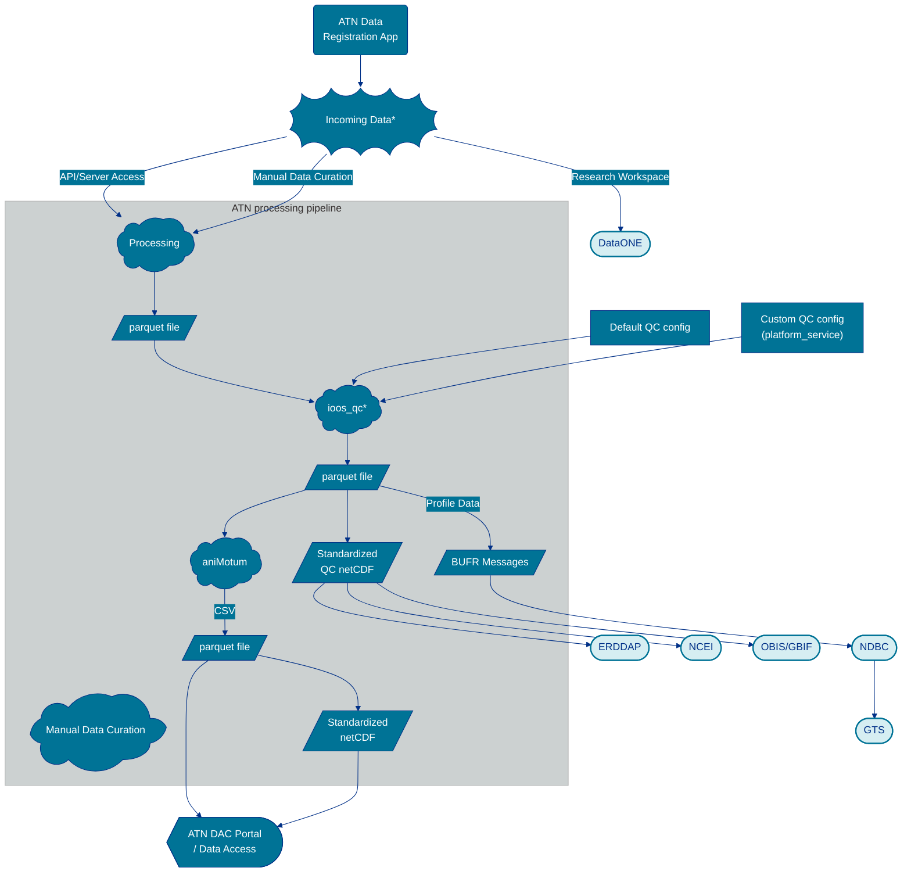

# Standard operating procedure for the Animal Telemetry Network 
This page documents the standard operating procedures for data flow in the U.S. Animal Telemetry Network (ATN) to various data repositories, national archive locations, servers, and the ATN data portal to increase discoverability, accessibility, and re-usability of ATN data. 

## Data Flow Summary

The diagram shows the ATN data ingestion and processing pipeline, from incoming data sources through QC, format conversion, and distribution pathways.

## Incoming Data Sources

The ATN DAC aggregates data from a variety of data sources both manually transferred by data providers or sourced directly from tag manufacturers' API or web server when available. ATN projects and new deployments need to first be registered through the [ATN Data Registration App](https://dacregistration.atn.ioos.us/accounts/login/?next=/) in order to be integrated into the ATN DAC. After registration, the ATN Data Coordinator will work with the data provider(s) to ensure metadata have been appropriately provide and confirm approval of data relase prior to integration into the DAC. 

Once approved and released, the ATN DAC can pull deployment data automatically from the following tag manufacturers, checking for incoming data every 30 minutes or every 2 hours, depending on the source:
- [Wildlife Computers](https://wildlifecomputers.com/)
- [Sea Mammal Research Unit](https://www.smru.st-andrews.ac.uk/index.html)
- [Woods Hole Group (a CLS North American company)](https://www.woodsholegroup.com/)

Manual data integration will be slower to integrate and pipelines are assessed for automation as data become more easily accessible from different manufacturers.

All ATN data can be viewed on the ATN Data Portal [here](https://portal.atn.ioos.us/?ls=HKwofDkA#map), and deployment data from the past 30-days viewable [here](https://portal.atn.ioos.us/?ls=q2VLkmP-#map).

## Processing

Incoming data, regardless of source, are processed into parquet files, standardized into netCDF, and quality controlled for integration into the ATN Data Portal and downstream data access points and archive repositories.

Deployments with animal-borne ocean profile data will get further processed into BUFR messages for submission to National Data Buoy Center (NDBC) and incorporation into the [Global Telecommunications System](https://community.wmo.int/site/knowledge-hub/programmes-and-initiatives/global-telecommunication-system-gts) (see [NDBC Submission](https://ioos.github.io/ioos-atn-data/ndbc-gts.html) section).

Animal trajectory data may be used as input into a state space model for modeled location estimates if it meets model input requirements (read more [here](https://ioos.github.io/ioos-atn-data/animotum.html)). If available, visualizations of the modeled location estimates will show up on the Platform Deployment pages.

## Data Distribution

Data are distributed to the [ATN Data Portal](https://portal.atn.ioos.us/) then to a variety of locations as appropriate, including NCEI, [IOOS ATN ERDDAP](https://atn.ioos.us/erddap/index.html), NDBC for incorporation into the GTS, OBIS/GBIF, and DataONE.
